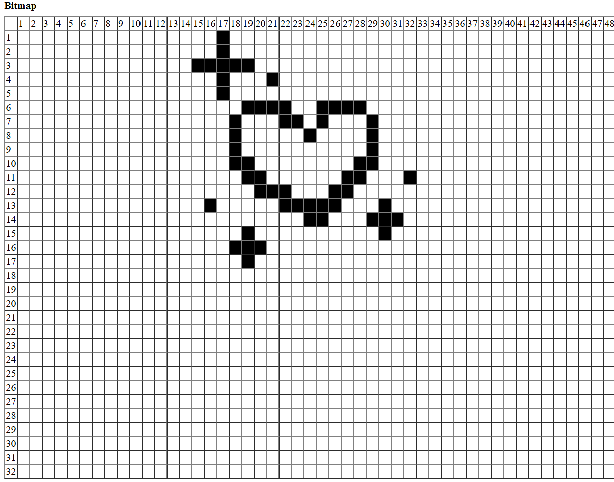
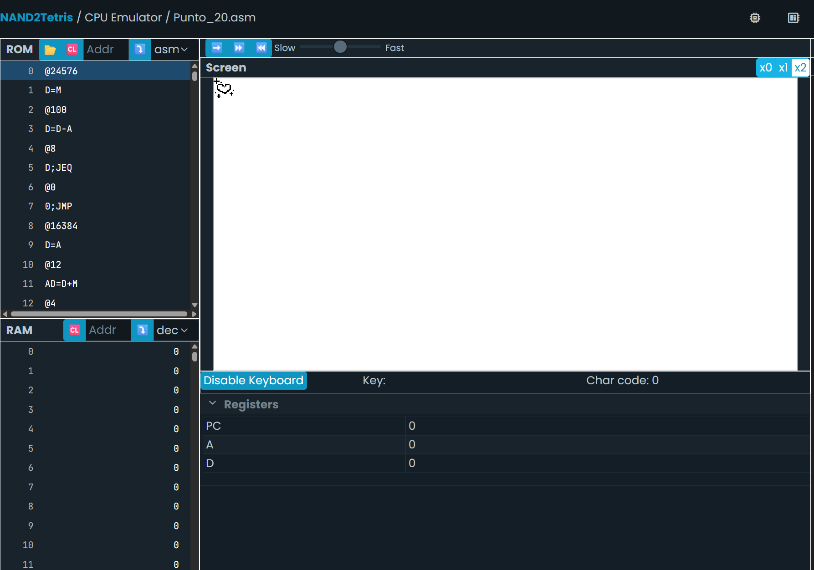

//Punto 8

-  ¿Qué hace este programa?
ESto suma el contenido de dos variables (var1, var2) 
y guarda el resultado en una tercera variable (var3)

Basicamente:
1. Carga el valor almacenado en var1 y lo guarda en el registro D.
2. Luego suma ese valor con el contenido de var2 y actualiza D con el resultado.
3. Finalmente, guarda ese resultado en la variable var3.

-  ¿En qué posición de la memoria está var1, var2 y var3? ¿Por qué en esas posiciones?
    - var1 en la posición 16
    - var2 en la posición 17
    - var3 en la posición 18
    Estas posiciónes se dan porque en el lenguaje ensamblador las variables no definidas 
    son asignadas automaticamente a partir de la dirección 16 en la RAM y las guara en suseción,
    ósea 16, 17, 18

// Punto 9

- ¿Qué hace este programa?
    inicia la variable "i" con 1, luego se iniciliza la variable "sum" con 0, Se suma el valor 
    de i al valor de sum y guarda el resultado en sum e incrementa la variable i en 1, paraque
    al final sum quede con el valor de 1 y i con el valor 2

- ¿En qué parte de la memoria RAM está la variable i y sum? ¿Por qué en esas posiciones?
     "i" queda en la posición 16  y  "sum" queda en la posición 17. 
     Porque al ser variables no predefinidas el lenguaje ensamlador las asigna automáticamete
     desde la posición 16 en adelante según la cantidad de variables so predefinidas.

//Punto 11

- ¿Qué hace este programa?

    Este programa es un bucle que inicializa la variable i con 1000 y entra en un ciclo "LOOP" donde si i=0 salta a CONT (osea termina el bucle), si esto no pasa restarle uno a i (i-1) y vuelve al inicio del bucle (goto LOOP)

- ¿En qué memoria está almacenada la variable i? ¿En qué dirección de esa memoria?

    Como la variable "i" no esta definida  desde antes y se usa por primera vez en el codigo como "@i, esta variable se almacena en la RAM en la dirección 16

- ¿En qué memoria y en qué dirección de memoria está almacenado el comentario //`i = 1000?`

    Los comentarios en el lenguaje ensamblador no se almacenan solo sirven para ayudar a leer el codigo, por lo tanto el lenguaje los ignora del programa.

- ¿Cuál es la primera instrucción del programa anterior? ¿En qué memoria y en qué dirección de memoria está almacenada esa instrucción?

    La primera instricción de este programa es @1000 (solo es una instrucción), esta instrucción se guarda en la ROM y el lenguaje ensamblador la guarda en la dirección 0 de la ROM.
    
- ¿Qué son CONT y LOOP?

    Son eqtiquetas (Lables) de saltos que se usan para marcar posiciones especificas del programa. así:
    -LOOP: Marca el inicio de un bucle.
    -CONT: Marca el punto al que se debe continuar la ejecución una vez finalizado el bucle.
    Se deben usar como: @LOOP y @CONT para que el programa pueda hacer esa instrucción, y estas estan guardads en la ROM.

- ¿Cuál es la diferencia entre los símbolos `i` y `CONT`?

    "i" es una variable de datos almacenada en la memoria RAM que se modifica durante la ejecución del programa. 
    "cont" es una etiqueta del codigo, almacenada en la ROM que se usa para saber donde debe continuar cuando se termine el bucle.

// Punto 16

- ¿Qué hace este programa?  
    
    Suma todos los valores del arreglo "arr" y guarda el resultado en la variable "sum".
    
- ¿Cuál es la dirección base de arr en la memoria RAM?
    
    Al ser una variable no asignada el lenguaje ensamblador automaticamente la empieza a asignar desde la dirección de la RAM[16], y como arr tiene 10 posiciones va desde RAM[16], hasta RAM[25]
    
- ¿Cuál es la dirección base de sum en la memoria RAM y por qué? 

    Como la variable "arr" ocupa las direccipnes desde la RAM[16], hasta RAM[25], la variable "sum" ocupa la siguiente dirección disponible, osea la dirección RAM[26]
    
- ¿Cuál es la dirección base de j en la memoria RAM y por qué?  

    Esta variable usada en el ciclo for "j" también es una variable simbolica, por lo tanto se guarda en la proxima dirección disponible, así:  
        - "arr": RAM[16]-RAM[25]  
        - "sum": RAM[26]  

    Por lo tanto "j" esta en la dirección RAM[27].  

//Punto 18
(draw)
	// put bitmap location value in R12
	// put code return address in R13
	@SCREEN
	D=A
	@R12
	AD=D+M
	// row 1
	@4 // A holds val
	D=D+A // D = addr + val
	A=D-A // A=addr + val - val = addr
	M=D-A // RAM[addr] = val
	// row 2
	D=A // D holds previous addr
	@32
	AD=D+A
	@4 // A holds val
	D=D+A // D = addr + val
	A=D-A // A=addr + val - val = addr
	M=D-A // RAM[addr] = val
	// row 3
	D=A // D holds previous addr
	@32
	AD=D+A
	@31 // A holds val
	D=D+A // D = addr + val
	A=D-A // A=addr + val - val = addr
	M=D-A // RAM[addr] = val
	// row 4
	D=A // D holds previous addr
	@32
	AD=D+A
	@68 // A holds val
	D=D+A // D = addr + val
	A=D-A // A=addr + val - val = addr
	M=D-A // RAM[addr] = val
	// row 5
	D=A // D holds previous addr
	@32
	AD=D+A
	@4 // A holds val
	D=D+A // D = addr + val
	A=D-A // A=addr + val - val = addr
	M=D-A // RAM[addr] = val
	// row 6
	D=A // D holds previous addr
	@32
	AD=D+A
	@15600 // A holds val
	D=D+A // D = addr + val
	A=D-A // A=addr + val - val = addr
	M=D-A // RAM[addr] = val
	// row 7
	D=A // D holds previous addr
	@32
	AD=D+A
	@17800 // A holds val
	D=D+A // D = addr + val
	A=D-A // A=addr + val - val = addr
	M=D-A // RAM[addr] = val
	// row 8
	D=A // D holds previous addr
	@32
	AD=D+A
	@16904 // A holds val
	D=D+A // D = addr + val
	A=D-A // A=addr + val - val = addr
	M=D-A // RAM[addr] = val
	// row 9
	D=A // D holds previous addr
	@32
	AD=D+A
	@16392 // A holds val
	D=D+A // D = addr + val
	A=D-A // A=addr + val - val = addr
	M=D-A // RAM[addr] = val
	// row 10
	D=A // D holds previous addr
	@32
	AD=D+A
	@24600 // A holds val
	D=D+A // D = addr + val
	A=D-A // A=addr + val - val = addr
	M=D-A // RAM[addr] = val
	// row 11
	D=A // D holds previous addr
	@32
	AD=D+A
	@12336 // A holds val
	D=D+A // D = addr + val
	A=D-A // A=addr + val - val = addr
	M=D-A // RAM[addr] = val
	AD=A+1 // D holds addr
	@2 // A holds val
	D=D+A // D = addr + val
	A=D-A // A=addr + val - val = addr
	M=D-A // RAM[addr] = val
	// row 12
	D=A // D holds previous addr
	@31
	AD=D+A
	@6368 // A holds val
	D=D+A // D = addr + val
	A=D-A // A=addr + val - val = addr
	M=D-A // RAM[addr] = val
	// row 13
	D=A // D holds previous addr
	@32
	AD=D+A
	@28798 // A holds val
	D=D+A // D = addr + val
	A=D-A // A=addr + val - val = addr
	M=A-D // RAM[addr]=-val
	// row 14
	D=A // D holds previous addr
	@32
	AD=D+A
	@14848 // A holds val
	D=D+A // D = addr + val
	A=D-A // A=addr + val - val = addr
	M=A-D // RAM[addr]=-val
	AD=A+1 // D holds addr
	M=1
	// row 15
	D=A // D holds previous addr
	@31
	AD=D+A
	@32752 // A holds val
	D=D+A // D = addr + val
	A=D-A // A=addr + val - val = addr
	M=A-D // RAM[addr]=-val
	// row 16
	D=A // D holds previous addr
	@32
	AD=D+A
	@56 // A holds val
	D=D+A // D = addr + val
	A=D-A // A=addr + val - val = addr
	M=D-A // RAM[addr] = val
	// row 17
	D=A // D holds previous addr
	@32
	AD=D+A
	@16 // A holds val
	D=D+A // D = addr + val
	A=D-A // A=addr + val - val = addr
	M=D-A // RAM[addr] = val
	// return
	@R13
	A=M
	D;JMP
    

//Punto 19
Este programa utiliza el valor 16384 en la dirección RAM[16] que se usa como un indicador para saber en que parte de la memoria se va a escribir o se va a borrar.
Luego el programa revisa si se esta presionando alguna tecla leyendo la entrada del teclado que esta en la dirección @24576. Si no se esta presionando nada (osea e valor es 0), se borra escribiendo un 0 en la posición anterior a 16384, retrocediendo el indicador y eliminando lo que se habia escrito antes 
Por otra parte si, si presiona una tecla, compara el valor del teclado con la posición actual del indicador. Si el indicador aún no ha llegado al valor del taclado, escribe -1 en esa posición de memoria y avanza el indicador. Si lo supera no hace nnada más y entra en un bucle.
En resumen cuando no se presiona nada, borra lo que había, y cuando se presiona una tecla, escribe -1 desde la dirección 16384 hasta llegar al valor del teclado. Es como si se tratara de una barra que se llena o se vacía según la lo que se presione en el teclado.

//Punto 20

