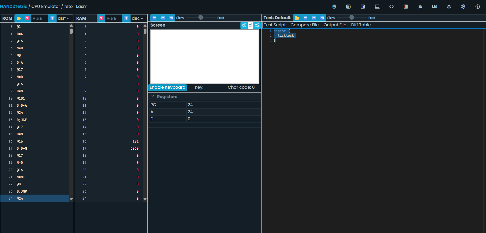
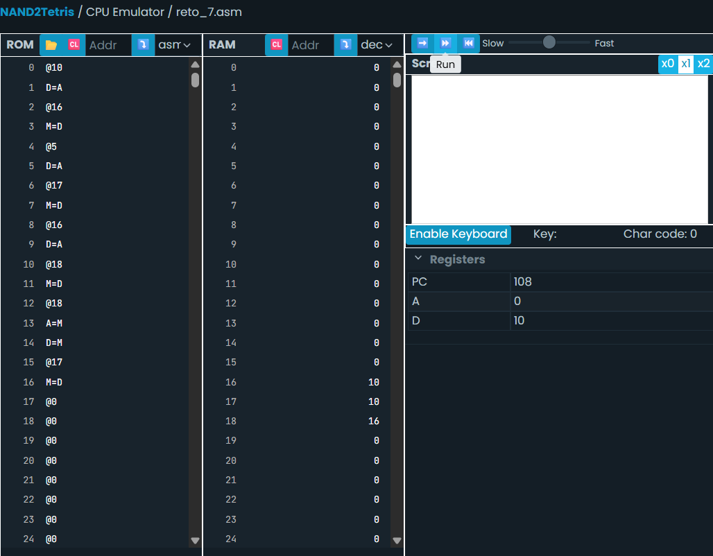
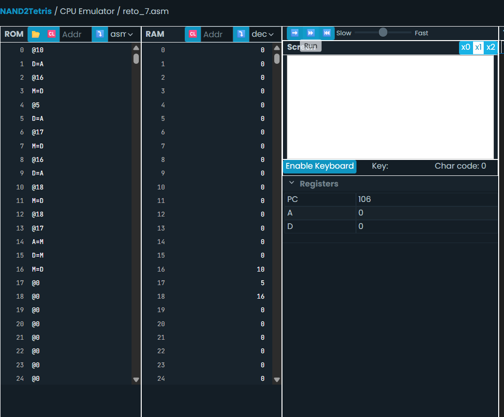
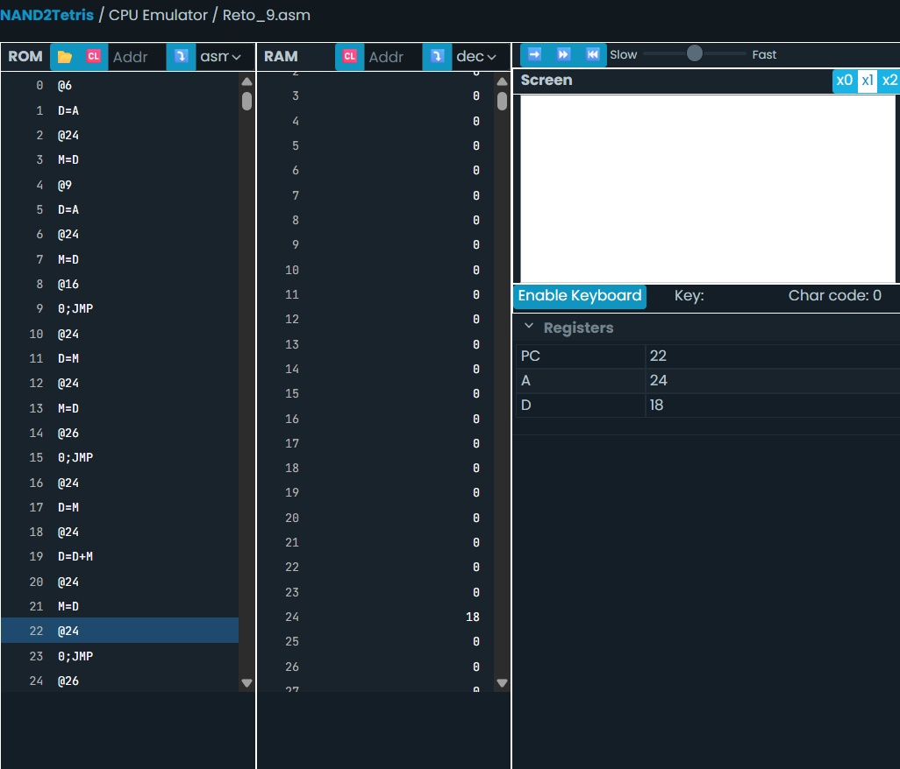
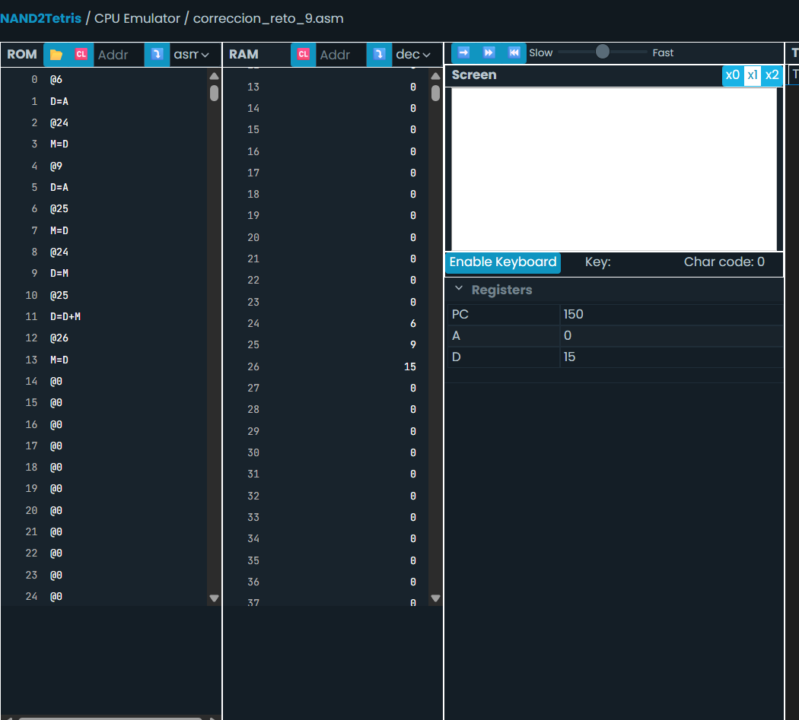

Reto 1.   

 - las variables como i y sum se implementan como etiquetas simbólicas (por ejemplo, @i y @sum). El ensamblador automáticamente les asigna direcciones de memoria a partir de la dirección RAM[16] en adelante si no están predefinidas.
 @i 
 M=D
 estamos guardando el valor del registro D en la dirección asociada a la variable i.  
 
 - Por el lenguaje si las variables no estan predefinidos "i" estaria en la RAM[16] y sum en la RAM [17]  
 - El ciclo while "(i <= 100)" está implementado usando etiquetas y saltos condicionales. Se usa una etiqueta como (LOOP) para marcar el inicio del bucle y otra (END) para indicar el final. Se compara i con 101 y si i >= 101, se hace un salto hacia END, terminando el bucle.
- La variable "i" se implementa como una posición de memoria que almacena un valor numérico en la memoria RAM. 
- La variable i se almacena en la memoria RAM[16], a menos que se defina de otra forma. Es la primera dirección disponible para variables no predefinidas.
- Es un nombre simbolico que representa una posición en la memoria RAM. Es un espacio donde puedes guardar, leer o modificar valores durante la ejecución del programa.
-  Es el número de la celda de memoria donde se almacena su valor. Por ejemplo, si i está en RAM[16], entonces su dirección es 16.
- es el valor que está guardado en su dirección de memoria. Por ejemplo:
Si i está en RAM[16] Y RAM[16] contiene el número 4, entonces: la dirección de i es 16, y su contenido es 4.

Reto 2.

int sum = 0;

for (int i = 1; i <= 100; i++) {
    sum += i;
}

Reto 3.

Al no tener en el lenguaje ensamblador esos ciclos, el programa seria el mismo del reto 1

Al principio no entendi muy bien porque 101, luego busque y me pude guiar un poco mejor 

Reto 7

Este fue el segundo intento que se hizo y este funciono lo uqe tenia mal es que estaba cargando en "A" la dirección guardada en p_var, y además, estaba  apuntando mal porque puse @bis antes de hacer A=M

El primer intento fue este 

Reto   9.   

Primero hice una versión pero me daba 18 no 15, revise las lineas y demas, pero me di cuenta que era como que estaba sumando a+a al estar guardado a y b en la misma dirección de memoria RAM [24].  

  

Pero luego de revisar el codigo, muchas cosas estaban mal y demasiado largo sin necesidad, se corrigio y ahora si funciono:

y como nota la linea de C++ "std::cout << "El valor de c es: " << c << std::endl;" no se puede traducir fielmente en el lenguaje ensamblador porque el emulador no lo permite salida visual, pero el resultado queda almacenado en la dirección RAM[26] que es visible.