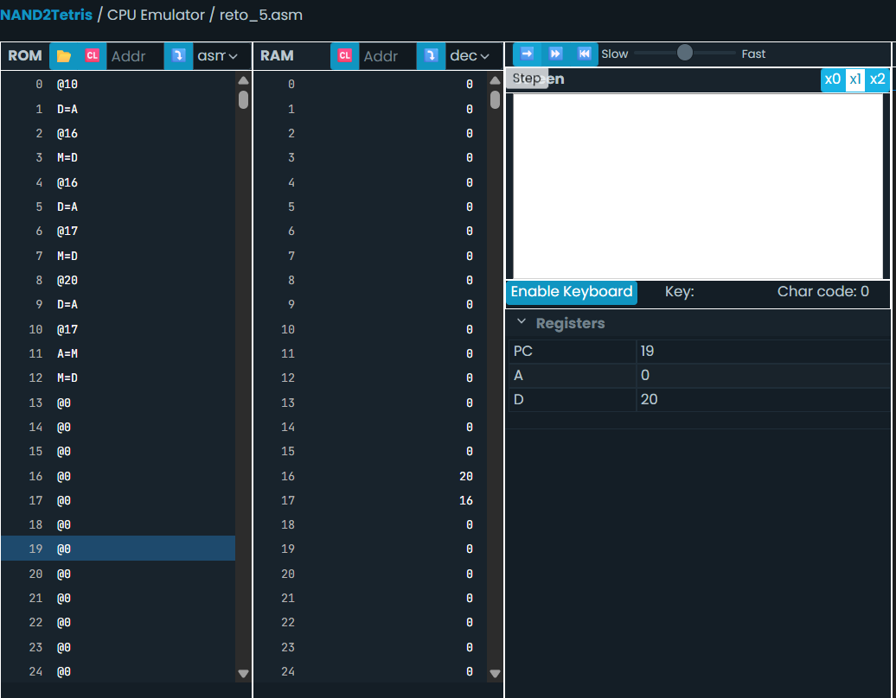

Reto 1.   

 - las variables como i y sum se implementan como etiquetas simbólicas (por ejemplo, @i y @sum). El ensamblador automáticamente les asigna direcciones de memoria a partir de la dirección RAM[16] en adelante si no están predefinidas.
 @i 
 M=D
 estamos guardando el valor del registro D en la dirección asociada a la variable i.  
 
 - Por el lenguaje si las variables no estan predefinidos "i" estaria en la RAM[16] y sum en la RAM [17]  
 - El ciclo while "(i <= 100)" está implementado usando etiquetas y saltos condicionales. Se usa una etiqueta como (LOOP) para marcar el inicio del bucle y otra (END) para indicar el final. Se compara i con 101 y si i >= 101, se hace un salto hacia END, terminando el bucle.
- La variable "i" se implementa como una posición de memoria que almacena un valor numérico en la memoria RAM. 
- La variable i se almacena en la memoria RAM[16], a menos que se defina de otra forma. Es la primera dirección disponible para variables no predefinidas.
- Es un nombre simbolico que representa una posición en la memoria RAM. Es un espacio donde puedes guardar, leer o modificar valores durante la ejecución del programa.
-  Es el número de la celda de memoria donde se almacena su valor. Por ejemplo, si i está en RAM[16], entonces su dirección es 16.
- es el valor que está guardado en su dirección de memoria. Por ejemplo:
Si i está en RAM[16] Y RAM[16] contiene el número 4, entonces: la dirección de i es 16, y su contenido es 4.

Reto 2.  

int sum = 0;

for (int i = 1; i <= 100; i++) {
    sum += i;
}

Reto 3.  

Como en el lenguaje ensamblador Hack no existen ciclos de alto nivel, el programa se desarrolla igual que en el Reto 1.   

   

Al principio no entendía muy bien por qué el contenido de la RAM[16] cambiaba, pero luego comprendí que actúa como un contador que se incrementa con cada iteración, mientras sum (en RAM[17]) acumula la suma. De esta manera, el ciclo continúa hasta que sum llega a 5050 y el contador i alcanza 101, momento en el que el bucle se detiene.  

Reto 5.  

Este reto se trabajó y explicó en clase, por lo cual no fue tan confuso, aunque surgieron algunas dudas durante la ejecución. 

Reto 6 y 7.  

Tuve una confusión al trabajar con la variable @p_var, ya que no estaba segura si estaba bien que se escribiera en RAM[18] la dirección de la variable @var. Sin embargo, entendí que sí es correcto, ya que @p_var actúa también como un puntero.  

Reto   9.   

Al principio hice una versión del código, pero el resultado era 18 en lugar de 15. Revisé las líneas y descubrí que estaba sumando a + a, porque accidentalmente había guardado ambos valores (a y b) en la misma dirección de memoria (RAM[24]).

Después de corregirlo, noté que muchas cosas estaban innecesariamente largas o mal organizadas, así que simplifiqué el código y finalmente funcionó.

y como nota la linea de C++ "std::cout << "El valor de c es: " << c << std::endl;" no puede traducirse literalmente en lenguaje ensamblador Hack, porque el emulador no permite salida visual. Sin embargo, el resultado final queda almacenado en RAM[26], lo cual es visible en la memoria.

Este seria el codigo definitivo, que es la traducción de las funciones y los saltos 

Este codigo parte de uno mas sencillo, que es:

// Guardar a = 6
@6
D=A
@24      // a se almacena en la dirección 24 
M=D     // a está en la dirección RAM[24] y vale 6.

// Guardar b = 9
@9
D=A
@25      // b se almacena en la dirección 25
M=D     //b está en la dirección RAM[25] y vale 9.

// Simular la función suma: var = a + b
@24
D=M      // D = a (D = RAM[24] = 6 (a))
@25
D=D+M    // D = a + b (D = 6(a) + RAM[25] = 6 + 9 = 15)

// Guardar el resultado en c
@26      // c en dirección 26
M=D
