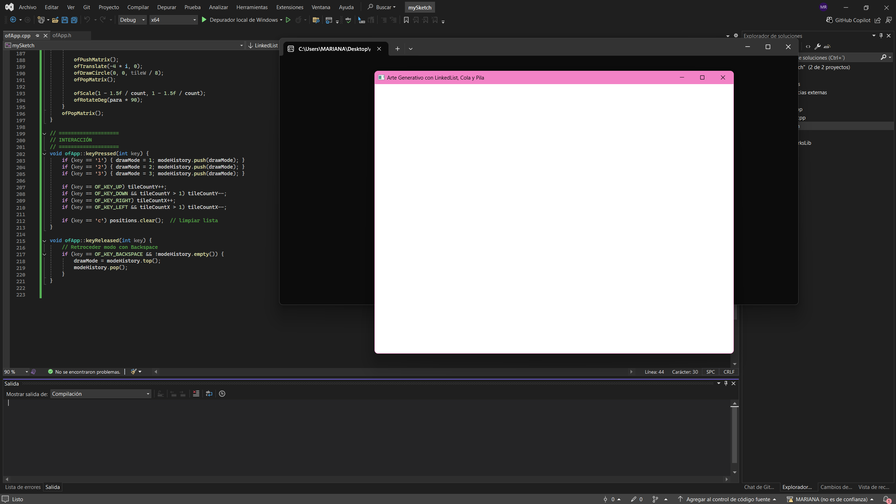
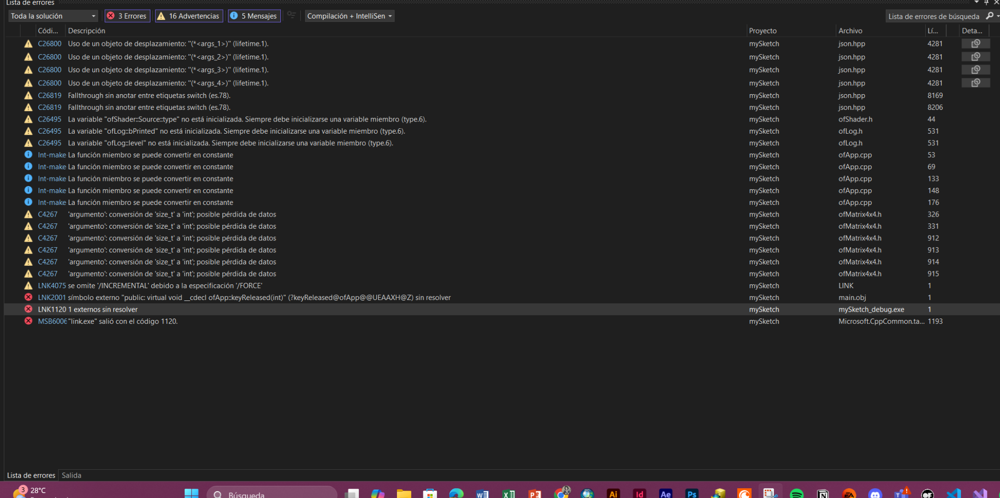
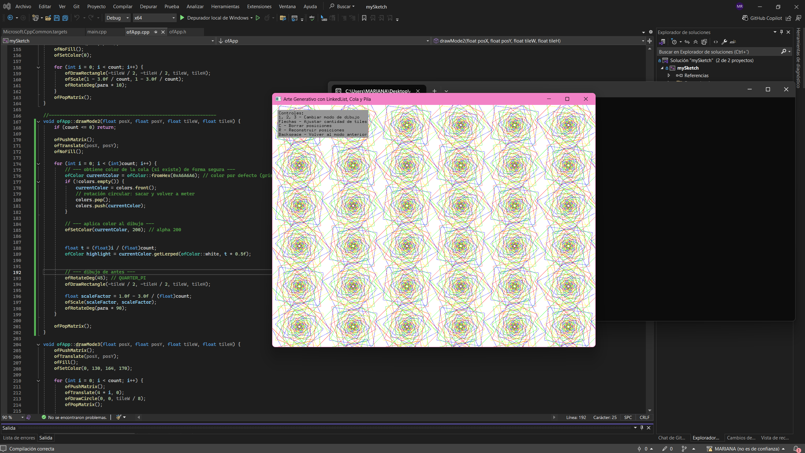
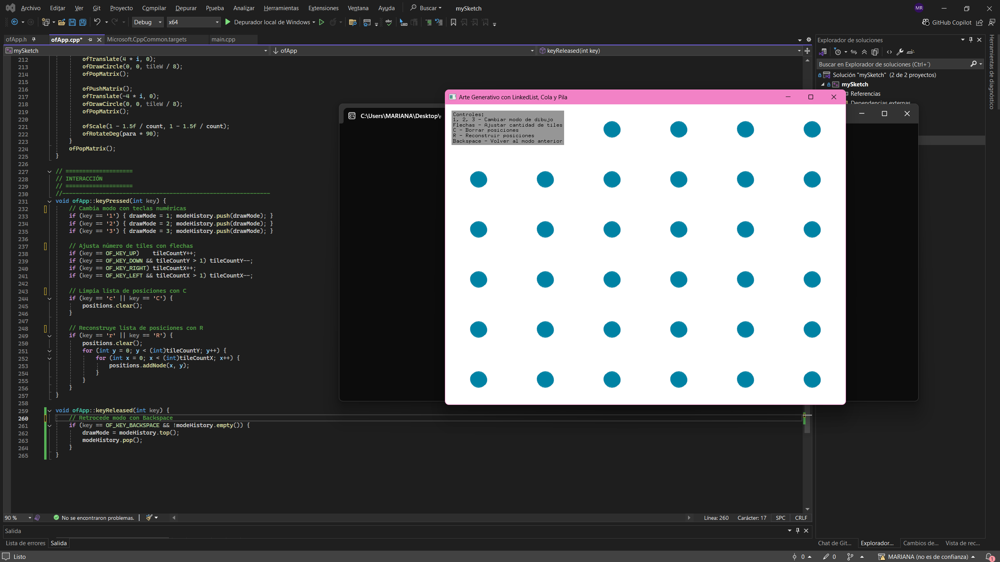
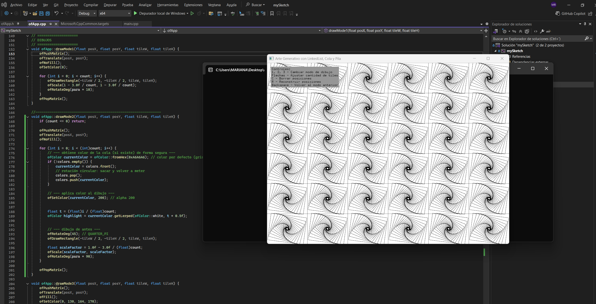
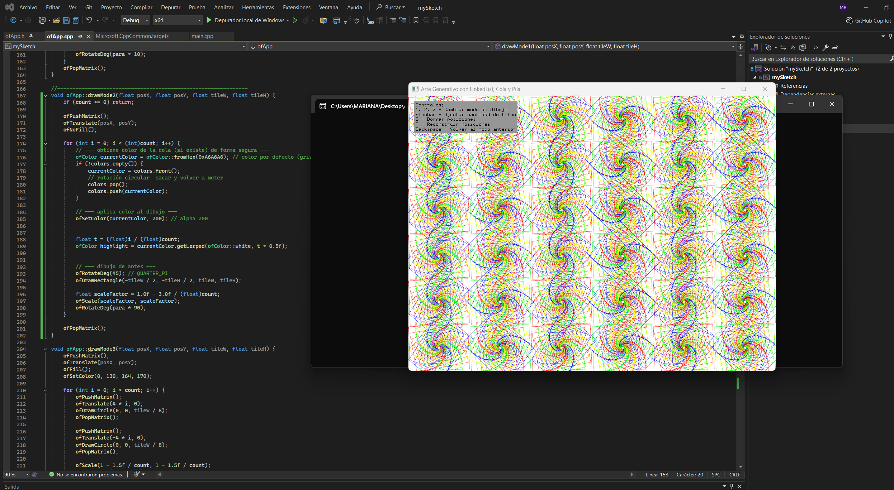
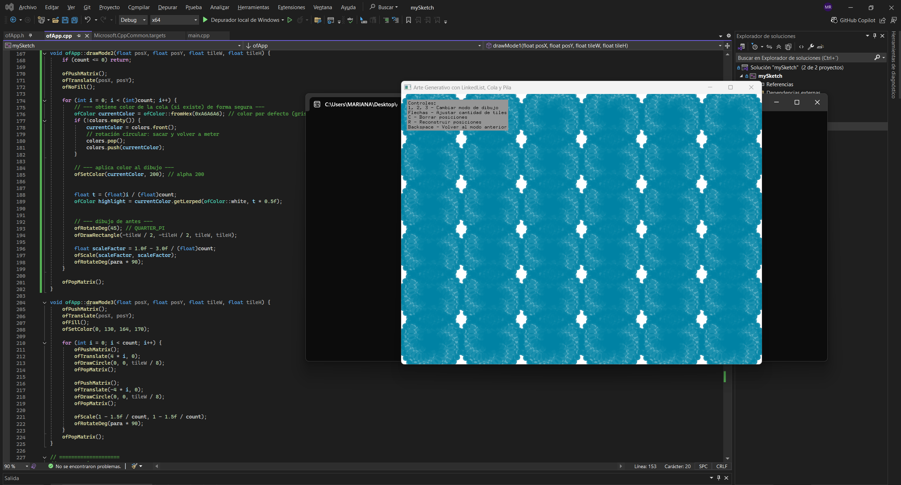

## Construcción de aplicaciones interactivas
Para este reto construí una aplicación en openFrameworks (C++) donde apliqué estructuras de datos (listas enlazadas, colas y pilas) para manejar posiciones, colores y modos de dibujo. El programa genera un arte interactivo en una grilla de tiles, donde puedo cambiar entre tres modos gráficos diferentes y controlar la cantidad de repeticiones según el movimiento del mouse.

### 1. Lista enlazada
```cpp
void ofApp::setup() {
    tileCountX = 6;
    tileCountY = 6;

    // Crear posiciones con lista enlazada
    for (int y = 0; y <= tileCountY; y++) {
        for (int x = 0; x <= tileCountX; x++) {
            positions.addNode(x, y);
        }
    }
}
```

Cada nodo guarda x, y y un puntero al siguiente.

### 2. Cola (queue) para almacenar colores
```cpp
colors.push(ofColor::red);
colors.push(ofColor::blue);
colors.push(ofColor::green);
colors.push(ofColor::yellow);
```

### 3. Pila para guardar el historial de modos de dibujo y poder retroceder.  
```cpp
if (key == '1') { drawMode = 1; modeHistory.push(drawMode); }
if (key == '2') { drawMode = 2; modeHistory.push(drawMode); }
if (key == '3') { drawMode = 3; modeHistory.push(drawMode); }
```

### 4. Modos de dibujo (arte generativo)

    - Modo 1: rectángulos en espiral.  
 
    - Modo 2: rectángulos con degradado y rotación progresiva.  

    - Modo 3: círculos en espejo con escalado.  

Ejemplo de uno de ellos 
```cpp
void ofApp::drawMode2(float posX, float posY, float tileW, float tileH) {
    if (count <= 0) return;

    ofPushMatrix();
    ofTranslate(posX, posY);
    ofNoFill();

    for (int i = 0; i < (int)count; i++) {
        // --- obtiene color de la cola (si existe) de forma segura ---
        ofColor currentColor = ofColor::fromHex(0xA6A6A6); // color por defecto (gris)
        if (!colors.empty()) {
            currentColor = colors.front();
            // rotación circular: sacar y volver a meter
            colors.pop();
            colors.push(currentColor);
        }

        // --- aplica color al dibujo ---
        ofSetColor(currentColor, 200); // alpha 200

     
        float t = (float)i / (float)count;
        ofColor highlight = currentColor.getLerped(ofColor::white, t * 0.5f);


        // --- dibujo de antes ---
        ofRotateDeg(45); // QUARTER_PI
        ofDrawRectangle(-tileW / 2, -tileH / 2, tileW, tileH);

        float scaleFactor = 1.0f - 3.0f / (float)count;
        ofScale(scaleFactor, scaleFactor);
        ofRotateDeg(para * 90);
    }

    ofPopMatrix();
}
```

### 5. interactivos con el tecldo   
```cpp
if (key == 'c' || key == 'C') {
    positions.clear();
}

if (key == 'r' || key == 'R') {
    positions.clear();
    for (int y = 0; y < tileCountY; y++) {
        for (int x = 0; x < tileCountX; x++) {
            positions.addNode(x, y);
        }
    }
}
```

##  Pruebas de la aplicación.  

### Lista enlazada  

Probé que al presionar la tecla "C" los nodos desaparecen "(positions.clear())."

Luego al presionar la tecla "R", los nodos se vuelven a generar.  

Para garantizar el funcionamiento de la aplicación, realicé pruebas por cada requisito de manera independiente y luego verifiqué el programa completo. de eso salio un error debido a que limpiaba la lista con la tecla "C" pero no podia volver a dibujar ningún modo , por lo tanto cree un condicional para reconstruir la lista de con la letra "R"

  

Al crear el nuevo "if" genero varios errore y advertencias
  

Que se pudieron solucionar al borrar una clase llamada "keyReleased" en el archivo ofApp.h la cual no estaba siendo usada y generaba errores debido a que habian definiciones duplicadas, pero al borrarlo y limpiar la solución el problema se arreglo.
Creando una buena compilación y un buen funcionamiento del programa 

### Cola de colores  


cuadrados/rectángulos en diferentes tonos → demuestra que los colores sí se toman de la cola.

### Pila en el historial  

Probé que al cambiar entre 1, 2, 3 se guarda el historial en la pila.  

```cpp
if (key == '1') { drawMode = 1; modeHistory.push(drawMode); }
if (key == '2') { drawMode = 2; modeHistory.push(drawMode); }
if (key == '3') { drawMode = 3; modeHistory.push(drawMode); }
```


Verifique presionando en orden 1 → 2 → 3, Luego presiona Backspace y la aplicación volvio al modo anterior. Aunque se demore un poco,

### Verificación de los nodos  
Probé uno por uno para confirmar que cada función (drawMode1, drawMode2, drawMode3) se ejecuta correctamente.

#### Modo 1.  



#### Modo 2.   



### Modo 3.   

