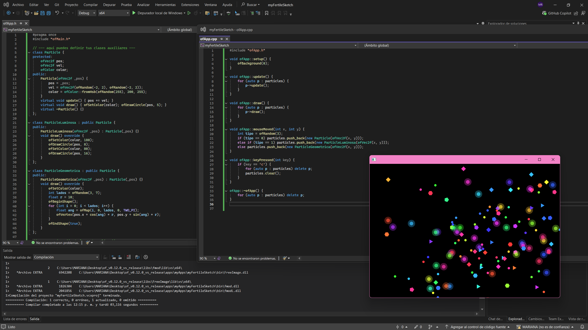
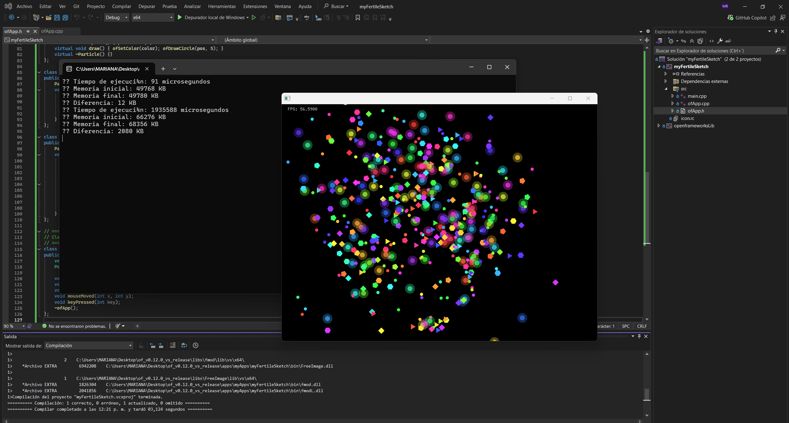
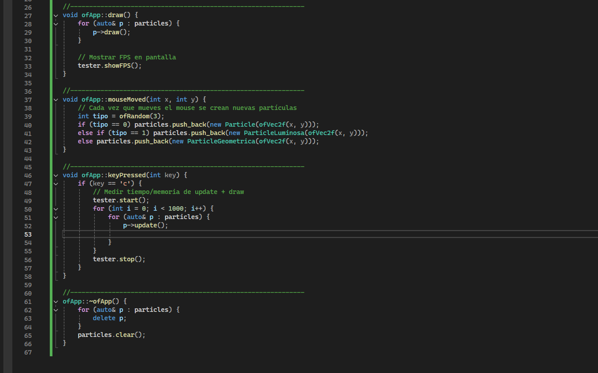
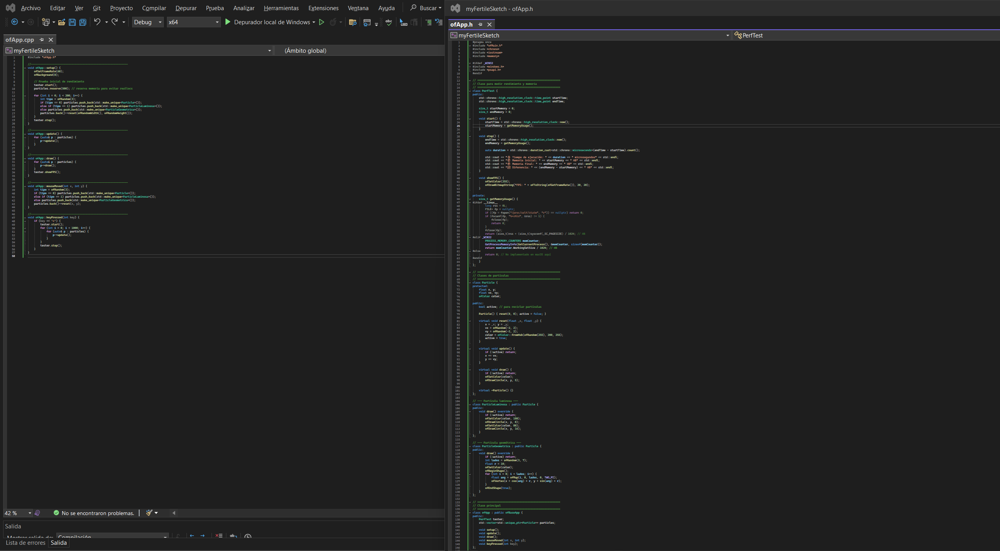
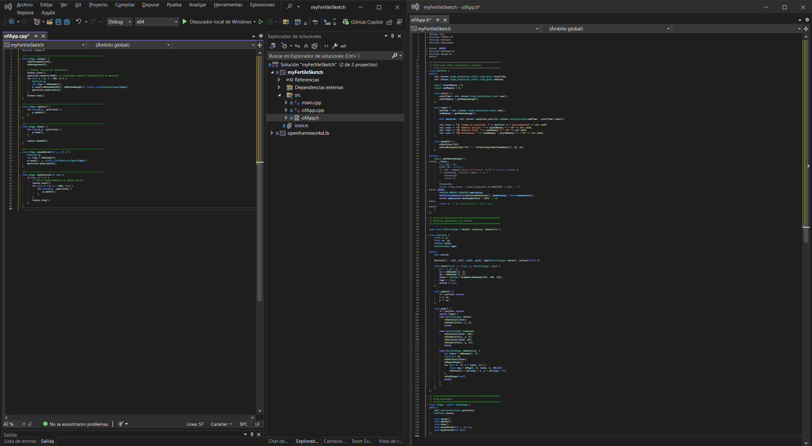
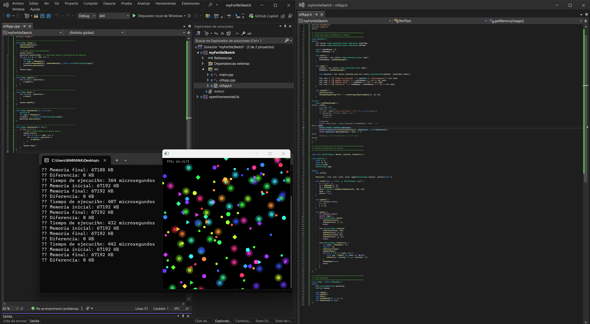

### Reto:    
La idea es crear un sistema de partículas que funcionan como “pinceladas digitales” y que reaccionan al movimiento del mouse. Cada partícula tiene su propio estilo visual (forma, color, velocidad), y usando herencia y polimorfismo se pueden generar diferentes tipos:

Partícula básica: un círculo que se mueve de manera aleatoria.

Partícula luminosa: parte de la básica, pero se dibuja con brillo y deja rastros.

Partícula geométrica: en lugar de círculos, genera polígonos que van cambiando.

Con el encapsulamiento, puedo controlar mejor las propiedades de cada partícula (posición, velocidad, color), y gracias al polimorfismo puedo guardar todas en un mismo vector, aunque cada una tenga su propio comportamiento al dibujarse y actualizarse.

En otras palabras encapsulo (pos, velocidad, color) las propiedades de cada partícula para que no se modifiquen directamente, sino solo a través de métodos (setPos(), getPos()) para mantener orden y seguridad en el código.  

Luego uso herencia para no repetir el codigo. Cada nueva partícula toma lo básico de la clase principal y solo agrego lo que cambio asi: "particle" es la clase base  que es la que hace que e circulo se mueva, "ParticleLuminosa" (hereda de Particle) hace que se agregue brillo  y estelas y por ultimo "ParticleGeometrica" (hereda de Particle) que dibuja formas cambiantes.

Y el polimorfismo me va a permitir manejar todas las partículas en un mismo contenedor, pero que cada una responda con su propio comportamiento. osea todas estan en un mismo vector  pero por ejemplo al llamar a "draw()", cada una se dibuja distinto 

Con relacion a la memoria, cada partícula ocupa espacio en memoria por sus datos, pero el comportamiento (métodos) se organiza con punteros virtuales para que se ejecute el correcto según el tipo de objeto. Así los datos (pos, velocidad, color) se guardan en memoria dentro de cada objeto, los métodos no se duplican, se guardan en la sección de código y cada objeto sabe a qué método llamar y con vtables, el programa sabe cuál draw() ejecutar dependiendo del tipo real de partícula o aplico el polimorfismo dinámico 

### Desarrollo:  
Primer cree el codigo base y este fue su resultado:
  

Pero mirando las recomendaciones hice un experimentoel cual muestra tiempo, memoria y FPS, siendo este el resultado:  
  
Al undir la tecla para limpiar se paraba y demoraba edn empezar, asi que revise que estaba pasando. Resulta que el codigo estaba dibujando para mostrar el impaccto de la memoria y eso no era necesario, así que lo optimicé  quitandole el pedazo de draw y asi ser mas funcional y eficiente 
  
Se optimizó la gestión de las partículas al cambiar su estructura de datos a float x e y para mayor ligereza. Se eliminó el uso de new y delete, implementando un sistema de reutilización (pool de objetos) donde las partículas simplemente se activan y desactivan. Esto previene fugas de memoria y reduce la fragmentación al evitar la creación de "basura" en la memoria.
   

Siguiendo la sugerencia de evitar los métodos virtuales para optimizar el rendimiento, se organizó la arquitectura de las partículas, reemplazando la jerarquía de clases (p. ej., ParticleLuminosa, ParticleGeometrica) por un modelo de clase única (Particle) que utiliza un campo enum (type) para determinar su comportamiento de dibujo y actualización. Esta implementación elimina el overhead del despacho dinámico (virtual), logrando una ejecución más directa y compacta que maximiza la localidad de referencia y el rendimiento del cache de la CPU. No obstante, esta solución introduce el desafío de que el bloque switch dentro del código de gestión puede volverse extenso y complejo de mantener si el número de tipos de partículas crece significativamente, quedando de esta manera 
  

### Reflexión  
Después de lo anterior quedo lo mas optimizado que pude 

- ¿Cómo influyó el entendimiento de los mecanismos internos de OOP en el proyecto?  
Entender cómo funcionan internamente conceptos como la herencia, el polimorfismo y el encapsulamiento influyó mucho porque ya no veía el código solo como instrucciones, sino como una estructura organizada. Eso me permitió pensar en cómo se relacionaban las clases entre sí, qué debía ser público o privado, y cuándo realmente valía la pena heredar o reutilizar funciones. En otras palabras, pude tomar decisiones más conscientes y no solo aplicar las cosas porque sí.
- ¿Qué desafíos enfrentaste y cómo los superaste?
Uno de los retos más grandes fue lidiar con el manejo de memoria y los métodos virtuales, porque al principio no entendía bien el costo que tenían en cuanto a eficiencia. Eso me generaba dudas de si lo estaba haciendo bien o si estaba complicando más el programa de lo necesario. Para superarlo, lo que hice fue investigar, leer ejemplos más sencillos y hacer pruebas en el código hasta darme cuenta de qué opción funcionaba mejor. Con eso aprendí que equivocarse también ayuda a comprender de verdad cómo se comporta el programa.
- ¿Qué aprendiste sobre el equilibrio entre diseño y eficiencia?  
Aprendí que en la programación no siempre se trata de hacer el diseño más elaborado o “perfecto” en teoría. A veces eso hace que el programa sea más pesado o difícil de mantener. Por eso entendí que toca encontrar un balance: que el código sea claro y ordenado para cualquiera que lo lea, pero sin dejar de pensar en el rendimiento. Ese equilibrio entre lo práctico y lo eficiente es lo que hace que un proyecto funcione bien en la vida real.