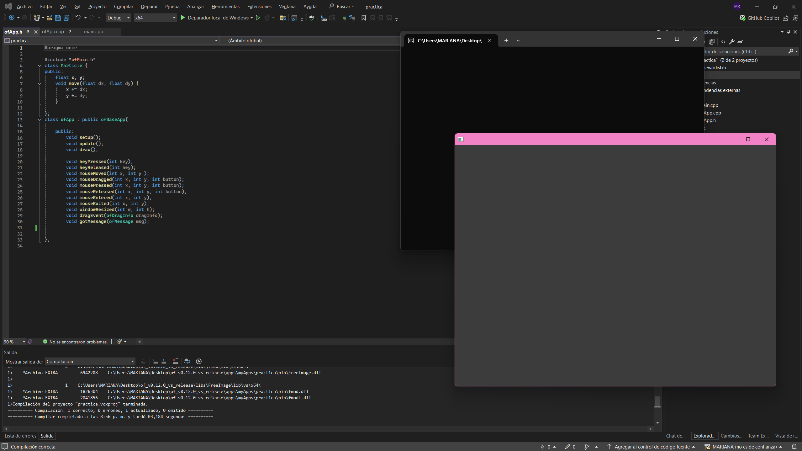
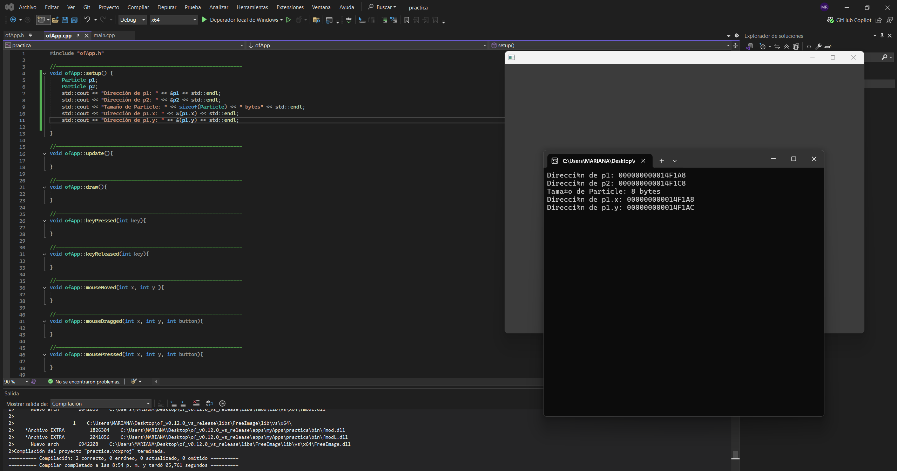

## sesion 1
  
- La clase Particle representa el plano o el molde de una partícula. Ahí defino qué datos va a tener (en este caso x e y, que son su posición) y qué puede hacer (como el método move para moverse). No es un objeto en sí, sino la plantilla que me permite crear muchos objetos Particle, cada uno con sus propios valores de x e y, pero todos compartiendo el mismo comportamiento.  

- En mi clase Particle, los atributos x e y representan el estado o la posición de la partícula. Los métodos son las funciones que interactúan directamente con esos atributos: algunos los leen y otros los modifican.
Por ejemplo, el método move(dx, dy) usa el valor actual de x e y y les suma los desplazamientos para cambiar la posición de la partícula. Es decir, los métodos se encargan de transformar o consultar el estado que guardan los atributos.

- Sí, al imprimir las direcciones de p1.x y p1.y me doy cuenta de que están uno al lado del otro en memoria. Los atributos se guardan de forma contigua en memoria (aunque puede haber pequeños espacios de alineación).

- El tamaño del objeto refleja la suma de sus atributos más cualquier relleno interno que agregue el compilador.  

- Los datos estáticos no afectan a la instancia en si porque no pertenecen a cada objeto, sino que se guardan una sola vez en la clase (espacio global compartido).

- Los datos dinámicos solo ocupan en el objeto el tamaño del puntero, mientras que la memoria real que se reserva con new vive aparte en el heap y hay que liberarla con el destructor delete.

### Reflexión 

- Un espacio reservado donde se guardan los valores de sus atributos. Cada objeto tiene su propia copia de esos datos, mientras que los métodos no ocupan espacio dentro de él porque se comparten entre todas las instancias.    

- Los atributos influyen en el tamaño porque cada objeto necesita espacio para guardar sus propios valores. En cambio, los métodos no afectan el tamaño del objeto, ya que son funciones compartidas por todas las instancias y no se guardan dentro de cada una. 

### Conclusión 
Entendí que el tamaño de un objeto depende de sus atributos, mientras que los métodos no ocupan espacio dentro de él. Esto me muestra que al diseñar clases debo pensar bien qué datos realmente necesita guardar cada instancia y qué puedo manejar como estático o compartido para no desperdiciar memoria.

## Sesion 2    
- Cuando una clase tiene métodos virtuales, cada objeto guarda un puntero extra que apunta a la tabla de funciones virtuales (vtable). Eso hace que el objeto ocupe un poco más de memoria que uno sin métodos virtuales.
- Las vtables son las que permiten que el programa sepa qué versión de un método debe ejecutar en tiempo de ejecución. Gracias a ellas, si llamo a display() desde un puntero a Base, el programa decide si usar la función de Base o la de Derived, haciendo posible el polimorfismo.  

- No son lo mismo. La vtable la crea el compilador para las funciones virtual y cada objeto tiene un puntero oculto (vptr) a esa tabla; eso permite el polimorfismo automático. El funcPtr de la clase es un miembro explícito que tú asignas y controlas manualmente. Ambos contienen direcciones de funciones, pero la vtable es un mecanismo del compilador para despacho dinámico, mientras que un puntero a función es solo un dato del objeto que puede apuntar a cualquier función compatible. (Ojo: hay también los pointer-to-member que funcionan distinto; aquí usamos un puntero a función estática, que es más simple.)  

- Llamar por un puntero a función o por una función virtual añade una indirección: en vez de una llamada directa, se tiene que cargar una dirección y saltar a ella. Eso impide que el compilador haga inlining y tiene un coste pequeño (una carga y un salto indirecto). En llamadas aisladas no es mucho problema, pero en bucles muy calientes puede notarse. La ventaja es la flexibilidad (puedes cambiar el comportamiento en tiempo de ejecución), así que es un trade-off entre rendimiento y diseño.  

### Conclusión   

- Los datos (atributos) de un objeto se guardan en memoria cuando se crea la instancia. En cambio, los métodos no se duplican en cada objeto, sino que el código de las funciones vive aparte en la sección de código del programa.  
- Cuando se usa un objeto, el programa accede a sus atributos directamente desde la memoria donde está guardado, y si se llama un método, el objeto solo pasa su dirección (this) para que la función sepa con qué datos trabajar.  
- Entender dónde están los datos y cómo se usan los métodos ayuda a organizar mejor las clases, ahorrar memoria y escribir sistemas más eficientes. También permite anticipar cómo se comporta el programa en tiempo de ejecución.  

## Sesion 3  

- El encapsulamiento es básicamente ocultar los detalles internos de una clase y controlar qué puede ver y usar el código externo. Su propósito es organizar mejor el programa, evitar que cualquiera modifique directamente los datos internos y obligar a usar métodos definidos (getters/setters o funciones) para interactuar con esos datos.

- Porque así se asegura que los datos se usen de la forma correcta. Si cualquiera pudiera cambiarlos desde afuera, sería muy fácil cometer errores, romper la lógica del programa o dejar el sistema en un estado incorrecto. Restringir el acceso da más control y hace el código más seguro y fácil de mantener.  

- "reinterpret_cast" es una forma de decirle al compilador: “trata esta dirección de memoria como si fuera de otro tipo”. Eso es muy arriesgado porque se puede terminar leyendo o escribiendo datos de una forma que no corresponde, lo que rompe la seguridad, puede causar errores raros y vuelve el programa poco confiable.

- Porque los miembros privados siguen existiendo en la memoria del objeto, el compilador solo prohíbe acceder a ellos escribiendo sus nombres en el código. Al usar punteros y reinterpret_cast, lo que se hace es leer directamente la memoria, y ahí el compilador ya no puede proteger nada.   

- Las consecuencias serían graves: el programa puede volverse inestable, dar resultados incorrectos, tener errores difíciles de encontrar o incluso abrir huecos de seguridad. Además, depende mucho del compilador y de cómo organice la memoria, así que puede que “funcione” en un caso y falle en otro.  

- Muestra que el encapsulamiento en C++ no es una barrera física, sino solo una regla del compilador. En condiciones normales basta para proteger los datos, pero si alguien fuerza el acceso con punteros o técnicas de bajo nivel, puede saltárselo. Por eso, el encapsulamiento es más una garantía de diseño y organización, no una protección absoluta contra accesos ilegales.  

- Los atributos se guardan en memoria de forma ordenada: primero los que vienen de la clase base y después los que son propios de la clase derivada. Es como si el objeto derivado llevara por dentro una copia de la clase base y, a continuación, sus propios datos.  

- Cada vez que agregamos un nuevo nivel de herencia, se va apilando uno sobre otro en la memoria. Es decir, primero se guarda la parte de la clase más antigua (la base), luego la de la siguiente clase, y así sucesivamente, hasta llegar a la última derivada. El objeto final es como una cadena de bloques, donde cada nivel de herencia ocupa su espacio dentro del mismo objeto.  

- El programa usa las vtables como una especie de “mapa” donde se guardan las direcciones de las funciones virtuales. Cada objeto tiene un puntero oculto (vptr) que apunta a la vtable de su clase. Así, cuando se llama a un método virtual como makeSound(), en lugar de ir directo al código, el programa consulta la vtable para saber qué versión de la función debe ejecutar (la de Dog, la de Cat, etc.).  

- El impacto es muy pequeño. La diferencia es que en vez de una llamada directa a la función, se hace un paso extra: mirar en la vtable cuál función corresponde y luego ejecutarla. Esto agrega un costo mínimo, pero la ventaja es enorme porque permite flexibilidad y reutilización con el polimorfismo.  

### Reflexión  

#### 1

- Encapsulamiento: el compilador controla el acceso con reglas (private, protected, public), pero los datos privados siguen estando en la memoria del objeto; lo que cambia es que no se puede acceder a ellos por nombre desde fuera de la clase.

- Herencia: el objeto derivado guarda primero la parte de la clase base y luego sus propios atributos, formando un solo bloque en memoria.

- Polimorfismo: se logra con las vtables y el puntero oculto (vptr) que cada objeto tiene, lo que permite decidir en tiempo de ejecución qué versión de un método virtual se ejecuta.

#### 2
- Ventajas:

    - Hace el código más organizado, legible y reutilizable.

    - Facilita mantener y extender programas grandes.

    - El polimorfismo da mucha flexibilidad para trabajar con diferentes tipos a través de una misma interfaz.

- Desventajas:

    - El polimorfismo introduce un costo extra mínimo en rendimiento (consultar la vtable).

    - El encapsulamiento no es una barrera absoluta, ya que se puede romper con punteros o casts inseguros.

    - Con herencia múltiple o jerarquías muy profundas, el diseño se puede volver más complejo y difícil de entender.
