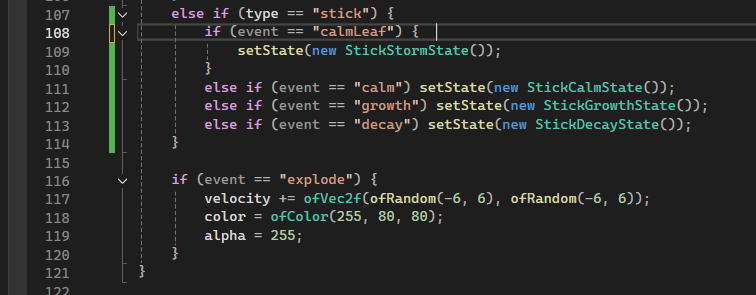
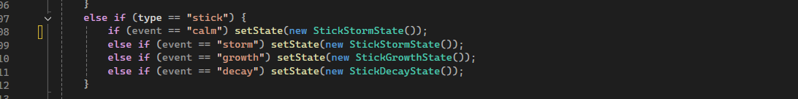
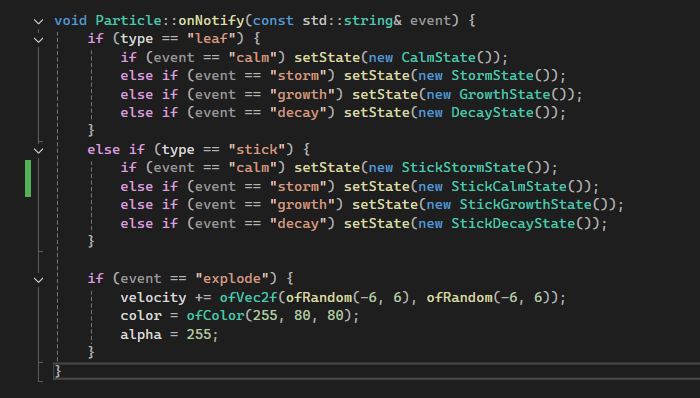
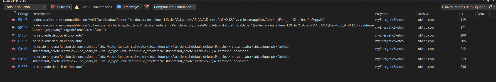
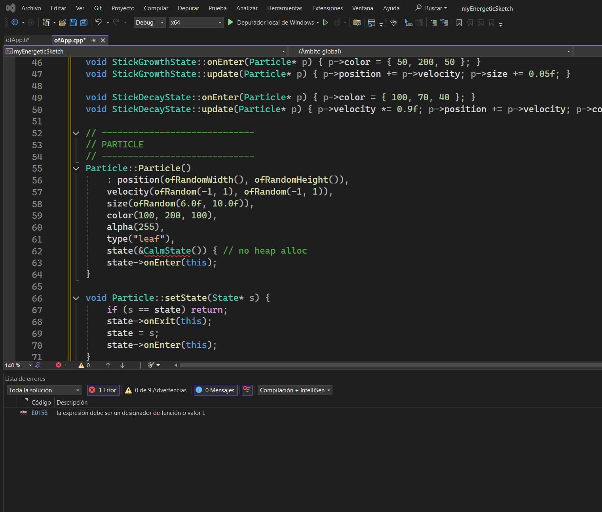
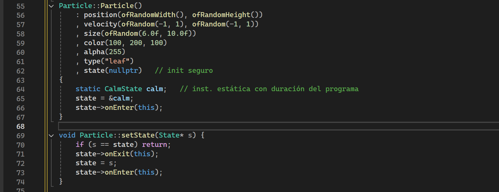

# Reto  
El espacio visual funciona como un paisaje vivo y cambiante.
Cada partícula —que puede ser una hoja, una gota o una semilla— se mueve de forma orgánica y sensible a las acciones del usuario.
Los colores y la energía del entorno cambian dependiendo del estado activo:

- En modo calma, el movimiento es lento y los tonos son suaves.

- En modo tormenta, las partículas se agitan con fuerza y los colores se vuelven más intensos.

- En modo crecimiento, nacen nuevas partículas y todo se llena de vida.

- En modo decadencia, las partículas comienzan a desaparecer lentamente.

La intención es que la persona que interactúe sienta que hace parte del sistema, como si sus acciones afectaran directamente el “clima” del ecosistema digital.  

## Aplicación de los Patrones de Diseño
### Observern  
El patrón para que el entorno principal se comunique con todas las partículas.
Cuando ocurre un evento (por ejemplo, un cambio de estado o una acción del usuario), el programa notifica a todas las partículas para que se actualicen.
Así, cada partícula reacciona de manera independiente, pero dentro del mismo sistema.

### Factory  
El patrón Factory para crear distintos tipos de partículas sin tener que cambiar la estructura del código.

Por ejemplo:

- LeafParticle: hojas que flotan.

- RainDrop: gotas que caen.

- Seed: semillas que germinan.

- WindParticle: corrientes de aire que afectan a las demás.

esto me permitira experimentar con diferentes comportamientos y estilos visuales de una forma flexible y ordenada.

### State  
Para representar los diferentes estados del ecosistema.
Cada uno modifica el comportamiento y apariencia general del entorno:

- CalmState → partículas suaves y lentas.

- StormState → movimiento rápido y caótico.

- GrowthState → aparición de nuevas partículas.

- DecayState → partículas que se desvanecen.

Gracias al patrón State pude hacer que el proyecto se sintiera más dinámico y emocional, como si el entorno tuviera “humores” o estados de ánimo.

### Interacción  
Movimiento del mouse: cambia la dirección o la intensidad del flujo de las partículas.  
Teclas:

C → calma.  
T → tormenta.  
G → crecimiento.  
D → decadencia.  

Cada acción provoca una respuesta inmediata, generando una sensación de diálogo entre el usuario y el entorno.

### Evidencias  
Primero cumpli con lo estipulado y este fue el resultado, con solo unn tipoen factory llamado "leaf" con los eventos anteriormente mencionados: 

#### Link de la evidencia:   
https://drive.google.com/file/d/1-LfB4OIHfaB925gKbX_reDcfEI7t9Os2/view?usp=drive_link

Luego observe que era muy sencillo y decidi adicionarle otro tipo, asi quedo "leaf" y "stick"  suscritos a eventos similares, la diferencia es que en el eventos storm el tipo stick no se sigue el mouse si no que lo repele:  

#### Link de la evidencia:  
https://drive.google.com/file/d/1N7dvfRLAVzErLm5DksD1JS7KYDcqFQSv/view?usp=sharing

Pero no quise quedarme con eso y queria que el tipo "stick" no estuviera suscrito al evento Calm si no que empezara en storm, quise preguntarle a la IA y esto fue lo que me dijo que modificara:    
  
pero esto no hizo lo que de verdad queria.

#### link de la evidencia:  
https://drive.google.com/file/d/1n-du2RpoILxPKtrPLiUqAFjRVCeDuV-w/view?usp=sharing

 asi que decidi hacerlo por mi sola al principio cambié una linea de codigo
  
pero esto no hizo la gran cosa, asi que decidi intercalar algunos eventos a ver si funcionaba, notificando en stick storm cuando estuviera en calma y en calma cuando estuviera en storm sin modificar los otros:   
  
Pero ahora van o más lento o más rapido :  

#### Link de la evidencia:   
https://drive.google.com/file/d/1xqopCPOQ8T3HhJ9G7m0iVpgstk1NnHiw/view?usp=sharing  

Nota: Profe no se porque me aparecia error si cuando cambié de computador ya me compilaba normal y bien, no era lo que queria pero no me generaba ningún error 

Ahora para optimizarlo le pregunte a la IA que podia mejorar la memoria y esto me respondio, "Eliminando la creación temporal de objetos de estado (como &CalmState()), que generan errores y punteros colgantes. En su lugar, usar instancias estáticas de cada estado, lo que permite reutilizarlas entre todas las partículas sin necesidad de crear ni destruir objetos repetidamente. Esto reduce el consumo de memoria, evita fugas y mejora el rendimiento, ya que los estados son únicos y persistentes durante toda la ejecución. Además, se puede ajustar el método setState para que sea seguro al manejar punteros nulos, garantizando transiciones de estado estables."

Al principio tuve muchos errores debido a que no modifique el archivo .h: 
   
Luego lo modifique  y me seguia generando un error   
  

Y ocurre cuando "&CalmState()" intenta tomar la dirección de un objeto creado en la expresión que se destruye inmediatamente, y queda un puntero colgante. Eso provoca comportamiento indefinido y el error del compilador, entonces reemplace el constructor de particle por esto  
  

Teniendo listo el programa.

#### Link de la evidencia:    
https://drive.google.com/file/d/1oG5htLxO8nRDhpfic36r9q4tRnUGekl4/view?usp=sharing  

Entonces por ejemplo, antes se usaba "new CalmState()" creando objetos nuevos en memoria cada vez. Ahora, se usa una instancia global reutilizable para reducir consumo y evitar fugas, asi:  

// -----------------------------
// CONSTRUCTOR OPTIMIZADO
// -----------------------------
Particle::Particle()
    : position(ofRandomWidth(), ofRandomHeight())
    , velocity(ofRandom(-1, 1), ofRandom(-1, 1))
    , size(ofRandom(6.0f, 10.0f))
    , color(ofColor(100, 200, 100))
    , alpha(255)
    , type("leaf")
    , state(&CalmState::instance()) {  // usa una instancia estática (singleton)
    state->onEnter(this);
}

Ya no se usa delete state; porque los estados son compartidos entre partículas. Esto evita errores de memoria y mejora el rendimiento.   

// -----------------------------
// CAMBIO DE ESTADO OPTIMIZADO
// -----------------------------
void Particle::setState(State* s) {
    if (state) state->onExit(this);   // ✅ no se borra el estado anterior
    state = s;
    if (state) state->onEnter(this);
}

Ahora los estados se manejan automáticamente:   

// -----------------------------
// DESTRUCTOR OPTIMIZADO
// -----------------------------
Particle::~Particle() {
    if (state) state->onExit(this);  // ✅ sin delete: los estados son singletons
}

y Con "static CalmState instance"; el estado se crea una vez y se comparte entre todas las partículas. 

// -----------------------------
// CALM STATE (SINGLETON)
// -----------------------------
class CalmState : public State {
public:
    static CalmState& instance() {    // ✅ método de acceso global
        static CalmState instance;
        return instance;
    }

    void onEnter(Particle* p) override {
        p->color = ofColor(100, 180, 120);
    }

    void update(Particle* p) override {
        p->velocity *= 0.97f;
        p->position += p->velocity;
    }

    ofColor getBackgroundColor() const override { 
        return ofColor(170, 210, 180); 
    }
};

