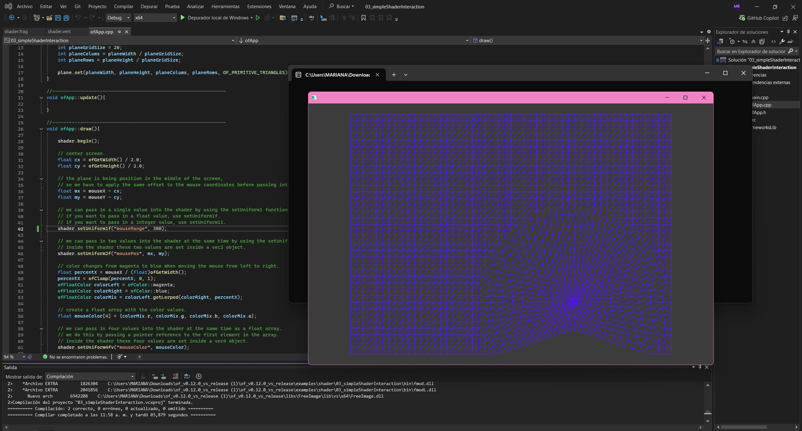

# Unidad 7  

## Actividad 1
Según los videos responder estas preguntas:   

### ¿Qué son los vértices?  
Los puntos que dan forma a los modelos 3D. Cada uno tiene información como su posición en el espacio, color, y dirección de la superficie. En conjunto, forman las figuras que vemos en un entorno 3D. 

### ¿Con qué figura geométrica se dibuja en 3D?  
Se construye con triángulos. Los modelos están compuestos por miles de estos triángulos unidos, creando lo que se llama una malla o mesh.  

### ¿Qué es un shader?  
Los shaders son pequeños programas que corren en la tarjeta gráfica (GPU). Su función es darle apariencia a los modelos, controlando cómo se ven los colores, las luces, las sombras y las texturas en cada superficie.  

### ¿Cómo se le llaman a los grupos de píxeles de un mismo triángulo?  
Los fragmentos son grupos de píxeles que pertenecen al mismo triángulo. Cada fragmento representa un posible punto visible en la pantalla, y luego se decide su color final.  

### ¿Qué es un fragment shader?  
El fragment shader se encarga de calcular el color de cada fragmento, aplicando efectos como la iluminación, las sombras, los reflejos y las texturas que hacen que las superficies se vean más realistas.  

### ¿Qué es un vertex shader?  
El vertex shader trabaja con cada vértice del modelo, transformando su posición desde el espacio 3D hasta el espacio 2D de la pantalla. Es el primer paso dentro del proceso de renderizado.   

### ¿Al proceso de determinar qué pixels del display va a cubrir cada triángulo de una mesh se le llama?  
Rasterización, que  es el proceso que determina qué píxeles del monitor van a ser cubiertos por cada triángulo de la malla. Básicamente, convierte los triángulos del modelo en fragmentos listos para colorear.  

### ¿Qué es el render pipeline?  
Todo el recorrido que sigue una imagen desde los datos 3D hasta mostrarse en pantalla. Incluye etapas como el vertex shading, la rasterización y el fragment shading.  

### ¿Hay alguna diferencia entre aplicar un color a una superficie de una mesh o aplicar una textura?  
Si hay diferencia, porque aplicar solo un color a una superficie es algo básico, mientras que aplicar una textura permite usar una imagen (por ejemplo, de madera o metal) para darle más detalle visual a la superficie, generando mas detalle visual.  

### ¿Cuál es la diferencia entre una textura y un material?  
Una textura es solo una imagen, pero un material combina varias texturas junto con propiedades como la rugosidad o el brillo, para definir cómo la luz reacciona sobre esa superficie.  

### ¿Qué transformaciones se requieren para mover un vértice del 3D world al View Screen?  
Para pasar un vértice del mundo 3D a la pantalla, se aplican tres transformaciones:  

- Model Matrix: posiciona el objeto en el mundo.  
- View Matrix: aplica la cámara.  
- Projection Matrix: transforma la escena al plano 2D de la pantalla.
  
### ¿Al proceso de convertir los triángulos en fragmentos se le llama?  
Se llama rasterización (es la etapa donde los triángulos se traducen en fragmentos o píxeles)  

### ¿Qué es el framebuffer?  
Un espacio en la memoria donde se guarda la imagen ya renderizada, lista para mostrarse en la pantalla del computador.  

### ¿Para qué se usa el Z-buffer o depth buffer en el render pipeline?  
Este buffer almacena la profundidad de cada píxel, para que el sistema sepa qué objetos están más cerca o más lejos. Así se evita que algo que está al fondo tape lo que está adelante.  

### Reflexión   
Después de ver el segundo video, entendí que la GPU tiene que ser tan rápida y trabajar de forma paralela porque en cada segundo debe procesar millones o incluso billones de cálculos para crear las imágenes que vemos en pantalla. Cada cuadro de un videojuego tiene miles de triángulos, luces, sombras y texturas que deben calcularse al mismo tiempo.  
Por eso la GPU no trabaja como un procesador normal (que hace una tarea a la vez), sino que tiene miles de núcleos que pueden ejecutar muchas operaciones al mismo tiempo, logrando que todo el proceso sea fluido y que los gráficos se vean en movimiento sin pausas ni retrasos.  

## Actividad 2  
### ¿Cómo funciona?  
El shader se encarga de dibujar un rectángulo en pantalla, pero en lugar de usar el color que yo le doy con ofSetColor, calcula el color directamente desde la GPU. Cuando activo el shader (shader.begin()), cada píxel cambia su color dependiendo de su posición en la ventana, creando un degradado.  

### ¿Qué resultados obtuviste?   
Al ejecutar el código con el shader activo, obtuve un degradado de colores donde el tono magenta aumenta de izquierda a derecha y el azul aumenta de abajo hacia arriba, mientras que el blanco se mantiene fijo. En cambio, cuando comenté el shader (dejando solo ofDrawRectangle), el rectángulo se volvió completamente blanco, sin degradado. Así:  


y con los cambios se genero esto:  

  

### ¿Estás usando un vertex shader?  
Sí, estoy usando un vertex shader. El archivo se encarga de transformar la posición de los vértices del rectángulo mediante la matriz modelViewProjectionMatrix, este define dónde se dibuja cada vértice.  

### ¿Estás usando un fragment shader?  
Sí, también estoy usando un fragment shader. Este es el que calcula el color de cada píxel usando la posición del fragmento en pantalla (gl_FragCoord). Gracias a eso se genera el efecto de degradado.  

### Analiza el código de los shaders. ¿Qué hace cada uno?
- Vertex Shader:  
Este shader toma la posición de cada vértice y la multiplica por la matriz de transformación para ubicar el rectángulo correctamente en la pantalla. No pinta nada, solo define la posición.  

- Fragment Shader:  
Este shader usa las coordenadas de cada fragmento para calcular su color. Divide la posición x y y por el ancho y alto de la ventana para obtener valores entre 0 y 1, generando un degradado de color según la ubicación en pantalla.  
## Actividad 3  
### ¿Qué es un uniform?   
Un uniform es una variable que se envía desde la aplicación hacia los shaders y que mantiene el mismo valor para todos los vértices o píxeles mientras se dibuja una figura.
Sirve para pasar información que no cambia dentro del mismo dibujo, como el tiempo, el color o la posición del mouse.
Por ejemplo, cuando en la app se usa "shader.setUniform1f("time", ofGetElapsedTimef());", ese valor del tiempo llega al shader para que este lo use en una animación o efecto.   

### ¿Cómo funciona el código, los shaders y su comunicación?
El código se encarga de crear los objetos, definir sus tamaños, colores y animaciones. Luego activa el shader con shader.begin() y le envía datos a través de uniforms.

El vertex shader recibe esos datos y modifica la posición de los vértices. Por ejemplo, usa una función sin() junto con el tiempo para crear un efecto de onda en el plano. Después, el fragment shader se encarga de pintar cada píxel, usando el color que le envía la aplicación con ofSetColor() o el uniform globalColor.
En conjunto, la app y los shaders se comunican constantemente: la app envía los valores y la GPU los usa para generar animaciones o efectos visuales en tiempo real.


Si comento las lineas "shader.begin() y shader.end()", crea esto:

    
Porque la app tiene que activar el shader con shader.begin() y luego cerrarlo con shader.end(). Mientras esas líneas están activas, todo lo que se dibuja entre ellas pasa por el shader, que modifica la posición de los vértices y genera la animación, asi, si la comento, el plano se dibuja directamente sin pasar por el shader, o sea, la GPU ya no aplica las deformaciones y por eso el plano se queda quieto.  

### Cambio colores  
  
se hizo el cambio de estas lineas en el ofApp.cpp:   

```  
	ofColor colorLeft = ofColor::royalBlue;  
	ofColor colorRight = ofColor::paleVioletRed;   
```  


## Actividad 4    
### ¿Qué hace el código del ejemplo?  
El código crea un plano (plane) en el centro de la pantalla y permite que los vértices se muevan dependiendo de la posición del ratón. Cuando el cursor se acerca, los vértices se alejan de él, creando un efecto de repulsión; Además, el color del plano cambia de magenta a azul según la posición horizontal del mouse.  
Todo esto se logra enviando tres uniforms distintos al shader:  
- mouseRange → define el rango de acción del ratón (qué tan lejos afecta a los vértices).
- mousePos → envía la posición del ratón en X y Y.  
- mouseColor → cambia el color dependiendo de dónde esté el mouse.

   

### ¿Cómo funciona el código de aplicación, los shaders y cómo se comunican?  
El código de aplicación (ofApp.cpp) calcula la posición del ratón (mouseX, mouseY) y la ajusta al centro del plano, enviando esos valores al shader usando funciones como:  
```  
shader.setUniform1f("mouseRange", 150);
shader.setUniform2f("mousePos", mx, my);
shader.setUniform4fv("mouseColor", &mouseColor[0]);
```    
Luego dibuja el plano con plane.drawWireframe() entre shader.begin() y shader.end() para que los shaders puedan aplicar sus efectos.  

#### Vertex Shader (sombreador de vértices):
Recibe los uniforms enviados desde la app, calcula la distancia entre cada vértice y la posición del ratónm, si el vértice está dentro del rango (mouseRange), lo desplaza alejándolo del mouse, generando ese movimiento de “repulsión” y finalmente, actualiza la posición del vértice con gl_Position.

#### Fragment Shader (sombreador de fragmentos):
Recibe el color del ratón (mouseColor) y lo aplica a cada píxel del plano así, el color cambia dinámicamente a medida que el mouse se mueve de un lado al otro.

### Comunicación entre ellos:
La app (CPU), envía los valores con uniforms, pata que el shader de vértices(GPU,) use esos valores para mover los vértices y el shader de fragmentos(GPU), use los valores para definir el color.
### Cambios en el .cpp y en el .vert
  
Ahora los vértices se “atraen” hacia el cursor, en lugar de repelerse y agrande el rango de vertices que se asercan al cursor 

### Cambios en el .frag  
<video controls src="20251022-1715-18.8557959.mp4" title="Title"></video>
En este caso cambie la dinamica de color y ahora respira y cada que muevo el mause cambia de color.

