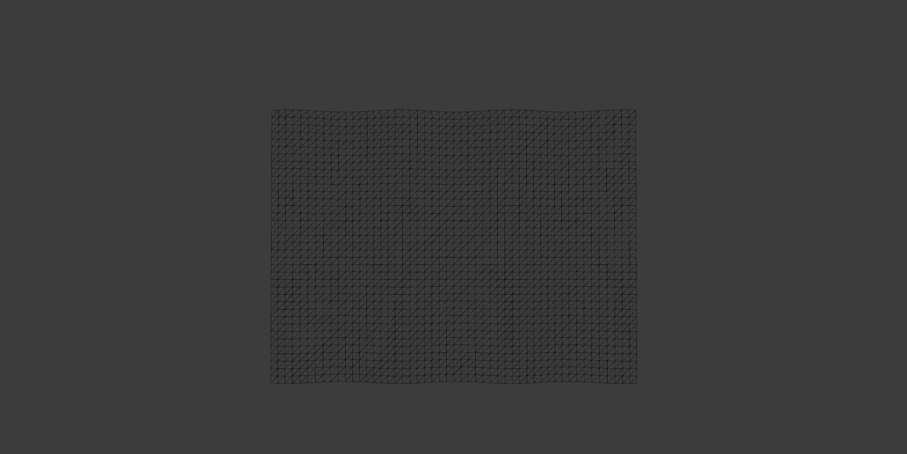
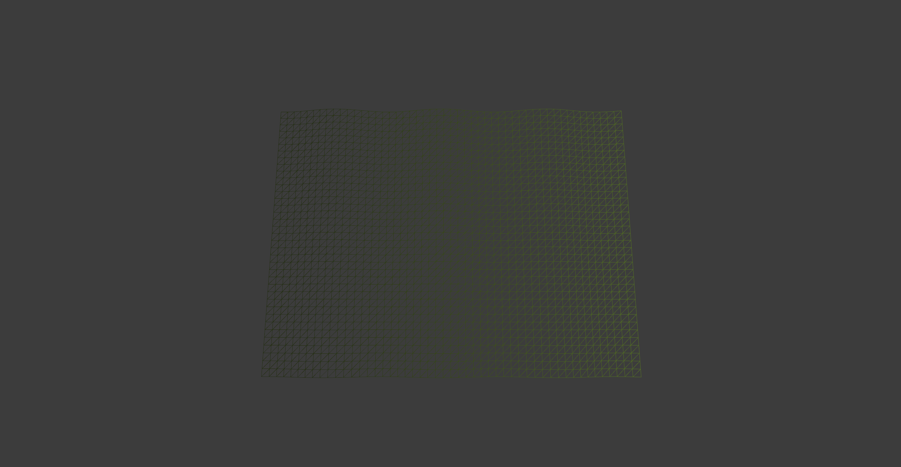
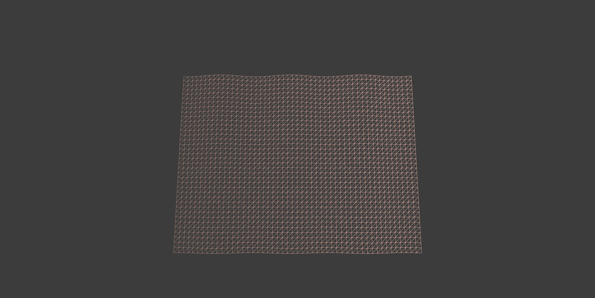
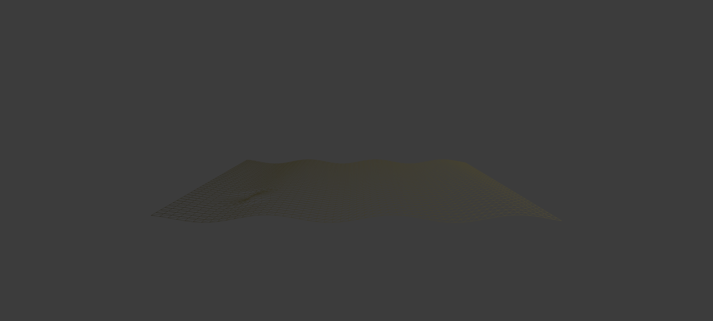

# RAE1  
## Idea principal  
Para este reto implementé la únion de las actividades anteriores implemntando un vertex shader y un fragment shader.
La idea principal es generar un plano en movimiento tipo onda, que reacciona a la posición del mouse y cambia sus colores de forma dinámica.
El plano se centra en la ventana y se deforma visualmente con un efecto de onda que se anima con el tiempo, mientras el color se modifica dependiendo de la posición del mouse en el eje X.

## Explicación detallada del funcionameiento del reto   
Mi aplicación es una escena interactiva hecha en C++ con openFrameworks, donde uso shaders para crear movimiento y color que cambian en tiempo real. Básicamente, el vertex shader se encarga de deformar el plano, y el fragment shader cambia los colores dependiendo del movimiento del mouse y del tiempo.

Cuando se inicia el programa, se carga el shader que corresponde según el tipo de renderizador y se crea un plano que cubre toda la ventana. Ese plano tiene una malla con muchos vértices que luego se van a mover con el shader. Durante la ejecución, el programa calcula la posición del mouse en relación al centro de la pantalla y le envía esa información al shader, junto con el tiempo que lleva corriendo, el rango de acción del mouse y el ancho de la pantalla. Gracias a eso, todo se actualiza de forma interactiva.

El color del plano también cambia según el mouse. Si muevo el cursor de un lado a otro, los colores se mezclan entre rosa claro y verde amarillento, creando una transición suave. Además, cuando subo o bajo el mouse, el plano gira, lo que da una sensación de profundidad y hace que se vea más dinámico.

En el vertex shader, cada vértice del plano se mueve en el eje Z usando una onda tipo coseno, lo que genera un efecto ondulante que parece tener movimiento propio. También calcula qué tan cerca está el mouse de cada vértice, y si está dentro de un rango, los vértices se alejan un poco del cursor, creando un efecto de repulsión.

El fragment shader se encarga del color. Crea un degradado que cambia dependiendo de la posición del mouse y del tiempo, y además aplica una onda de color que hace que los tonos varíen como si el plano respirara o tuviera vida.

Al final, la malla se dibuja en modo wireframe, y eso permite ver cómo se deforman las líneas y cómo cambian los colores al mismo tiempo. Todo reacciona al movimiento del mouse, haciendo que la experiencia sea visualmente atractiva e interactiva. En resumen, mi aplicación combina animación, color y movimiento en tiempo real, usando los shaders para darle un toque más artístico y vivo al plano.    

## Codigo fuente  
### OffApp.cpp
```python
#include "ofApp.h"
 
//--------------------------------------------------------------
void ofApp::setup() {
	if (ofIsGLProgrammableRenderer()) {
		shader.load("shadersGL3/shader");
	}
	else {
		shader.load("shadersGL2/shader");
	}
 
	int planeWidth = ofGetWidth();
	int planeHeight = ofGetHeight();
	// tamaño del plano
	int planeGridSize = 20;
	int planeColums = planeWidth / planeGridSize;
	int planeRows = planeHeight / planeGridSize;
	//crear el plano|
	plane.set(planeWidth, planeHeight, planeColums, planeRows, OF_PRIMITIVE_TRIANGLES);
}
 
//--------------------------------------------------------------
void ofApp::update() {
 
}
 
//--------------------------------------------------------------
void ofApp::draw() {
 
	shader.begin();
 
	// centro de  la pantalla
	float cx = ofGetWidth() / 2.0;
	float cy = ofGetHeight() / 2.0;
 
	{
 
	}
	// Calcula la posición del mouse relativa al centro
	float mx = mouseX - cx;
	float my = mouseY - cy;
 
	shader.setUniform1f("mouseRange", 100); //área de influencia del mouse.
	shader.setUniform1f("time", ofGetElapsedTimef()); //tiempo desde wue se inició la aplicación.
	shader.setUniform2f("mousePos", mx, my); //posicion del mouse relativa al centro.
	shader.setUniform1f("screenWidth", ofGetWidth()); //ancho de la pantalla, para el degradado 
	shader.setUniform1f("mouseXPos", mouseX / (float)ofGetWidth());// posicion x del mouse normalizada [0,1]
 
	float percentX = mouseX / (float)ofGetWidth(); //Calcula un valor entre 0 y 1 según la posición del mouse en el eje X
	percentX = ofClamp(percentX, 0, 1); //asegurarse que el valor no salga de ese rango
	ofFloatColor colorLeft = ofColor::lightPink;
	ofFloatColor colorRight = ofColor::greenYellow;
	ofFloatColor colorMix = colorLeft.getLerped(colorRight, percentX); //mezcla los dos colores según la posición del mouse
 
	float mouseColor[4] = { colorMix.r, colorMix.g, colorMix.b, colorMix.a };// convierte el color a un array de floats para enviarlo al shader
 
 
	shader.setUniform4fv("mouseColor", mouseColor);// envía el color al shader
 
	ofTranslate(cx, cy);
 
// controles de la rotacion 
	float percentY = mouseY / (float)ofGetHeight();
	float rotation = ofMap(percentY, 0, 1, -60, 60, true) + 60;
	ofRotateDeg(rotation, 1, 0, 0);
 
	plane.drawWireframe();
 
	shader.end();
}
 ```

 ### .vert   
```python
 OF_GLSL_SHADER_HEADER
 
// variables del sistema
uniform mat4 modelViewProjectionMatrix;
in vec4 position;
 
// uniforms existentes
uniform float mouseRange;
uniform vec2 mousePos;
uniform vec4 mouseColor;
 
// agregar  tiempo para animar la onda
uniform float time;
 
void main()
{
 
float displacementHeight = 100.0;
    float displacementY = sin(time + (position.x / 100.0)) * displacementHeight;
    vec4 pos = position;
    // --- Movimiento tipo onda coseno ---
    // Se usa la posición x e y para crear una superficie que oscila
    float wave = cos(pos.x * 0.02 + time * 2.0) * 10.0;  // amplitud = 100
    pos.z += wave; // desplazamiento en el eje z
 
    // --- Repulsión del mouse ---
    vec2 dir = pos.xy - mousePos; //Calcula el vector y distancia entre el vértice y el mouse.
    float dist = sqrt(dir.x * dir.x + dir.y * dir.y);
 
    if(dist > 0.0 && dist < mouseRange) {
        float distNorm = 1.0 - (dist / mouseRange);
        dir *= distNorm;
        pos.x -= dir.x;
        pos.y -= dir.y;
    }
 
    gl_Position = modelViewProjectionMatrix * pos;
}
 ```
### .frag   
```python
OF_GLSL_SHADER_HEADER
 
// variabales enviads 
out vec4 outputColor;
 
uniform vec4 mouseColor;
uniform float time;
uniform float screenWidth;
uniform float mouseXPos; // posición horizontal normalizada (0–1)
 
void main()
{
    // --- Onda de color basada en coseno ---
 
    float wave = cos(time * 2.0) * 0.5 + 0.5; // valor entre 0 y 1
 
    // --- Degradado dinámico controlado por el movimiento del mouse ---
    float gradient = (gl_FragCoord.x / screenWidth) - (mouseXPos - 0.5);
    gradient = clamp(gradient, 0.0, 1.0);
 
    //generado por IA en el ejercico anterior
    // --- Color base y mezcla ---
    vec4 darker = vec4(mouseColor.rgb * 0.2, 1.0);
    vec4 color = mix(darker, mouseColor, gradient);
 
    // --- Aplicar onda de color tipo coseno ---
    color.rgb *= wave;
 
    outputColor = vec4(color.rgb, 1.0); //Asigna el color final del píxel (con opacidad completa).
}
 ```

## Video  
https://youtu.be/4-dnOOCd3Zc   

# RAE2  

## Explicaciones y pruebas  
### ofApp.cpp   
Para probar la parte del código principal (ofApp.cpp), lo que hice fue revisar que los uniforms se enviaran correctamente al shader y que los valores cambiaran según el movimiento del mouse.
Primero probé que el plano se creara bien en el centro de la ventana y que su tamaño correspondiera al ancho y alto de la pantalla. Después, moví el mouse por toda la ventana para comprobar que los valores mouseX, mouseY, mouseRange, mouseColor y time se actualizaran en tiempo real.
También hice pruebas con los colores, verificando que al mover el mouse de izquierda a derecha el color del plano pasara gradualmente del rosa claro al verde amarillento. Por último, confirmé que el plano rotara correctamente según la posición vertical del mouse.
  
  
  
  
### Vertex Shader  
Para probar el vertex shader, primero dejé solo el movimiento de onda con el coseno para ver si los vértices se deformaban correctamente. Noté que el plano empezaba a tener una oscilación suave en el eje Z, así que ajusté el valor de la amplitud (displacementHeight) para controlar qué tan fuerte era el movimiento.
Después activé la parte de repulsión del mouse, moviendo el cursor cerca del plano. Verifiqué que cuando el mouse se acercaba, los vértices más próximos se movían ligeramente hacia afuera, creando el efecto de que el plano “reacciona” al movimiento del cursor.    
### fragment shader   
En el fragment shader, comencé probando el color base sin animaciones para asegurarme de que el degradado funcionara. Luego moví el mouse a lo largo del eje X para comprobar que el color pasara de rosa a verde, lo cual confirmó que el cálculo de mezcla (lerp) estaba correcto.  
Después activé la animación de color basada en el coseno del tiempo (cos(time * 2.0)), y observé que el plano empezaba a cambiar de brillo lentamente, como si el color vibrara.
Finalmente, ajusté el degradado dinámico para ver cómo respondía el shader a la posición horizontal del mouse (mouseXPos). Al mover el cursor, el degradado se desplazaba en dirección contraria, generando una sensación de profundidad visual.  
### App completa   
Ya con los dos shaders funcionando, probé toda la aplicación en conjunto. Moví el mouse por toda la ventana, tanto horizontal como verticalmente, para asegurarme de que el color, la rotación y la deformación respondieran al mismo tiempo sin errores.
También dejé correr la aplicación varios minutos para comprobar que la animación no se detuviera ni se ralentizara con el paso del tiempo.
Finalmente, revisé que al cerrar y volver a ejecutar la aplicación los shaders se cargaran correctamente, sin fallas de compilación ni errores en consola.  
